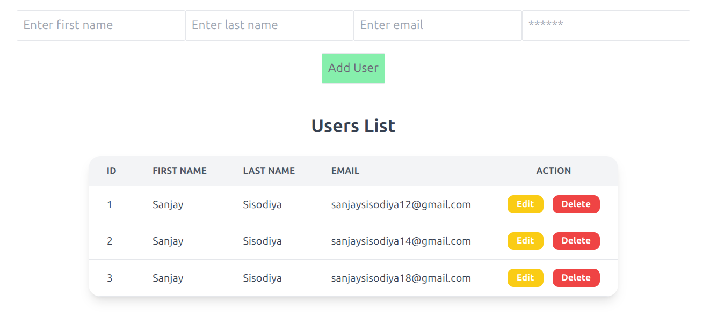
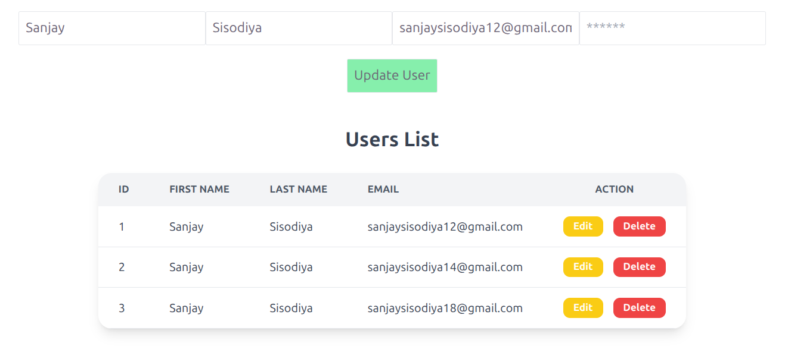

# 🚀 User Management System (Laravel + React + Redux Toolkit)

This is a full-stack User Management (CRUD) application built using Laravel (API) and React with Redux Toolkit for state management.

---

## 🚀 Tech Stack Used

### 🔹 Backend
- Laravel 12 (REST API)
- MySQL Database
- Laravel Sanctum (API Auth - optional)

### 🔹 Frontend
- React JS (Vite)
- Redux Toolkit (State Management)
- Axios (API Integration)

---

## ✨ Features

- ➕ Add new user  
- 📋 View all users  
- ✏️ Update user details  
- ❌ Delete user  
- 🔄 Real-time UI update using Redux  
- 📡 API integration with Laravel backend  

---

## 📂 Project Structure

### 🔹 Backend (Laravel)

```bash
backend/
├── app/
│   ├── Http/Controllers/
│   │   └── UserController.php
│   ├── Models/
│   │   └── User.php
│
├── database/
│   └── migrations/
│       └── add_fields_to_users_table.php
│
├── routes/
│   └── api.php


Frontend (React)
src/
├── app/
│   └── store.js
│
├── features/users/
│   ├── userSlice.js
│   └── userAPI.js
│
├── components/
│   ├── UserForm.js
│   └── UserList.js
│
└── App.js
```

## ⚙️ Setup Instructions

```bash
Backend (Laravel)

cd backend
composer install
cp .env.example .env
php artisan migrate
php artisan install:api
php artisan serve
```
👉 API will run on:
http://127.0.0.1:8000

```bash
Frontend (React)

npm create vite@latest
npm install
npm install axios
npm install @reduxjs/toolkit
npm install react-redux

npm run dev
```
👉 Frontend will run on:
http://localhost:5173

## Screenshots

### All Tasks & Add Task



### Edit User | Update User | Delete

